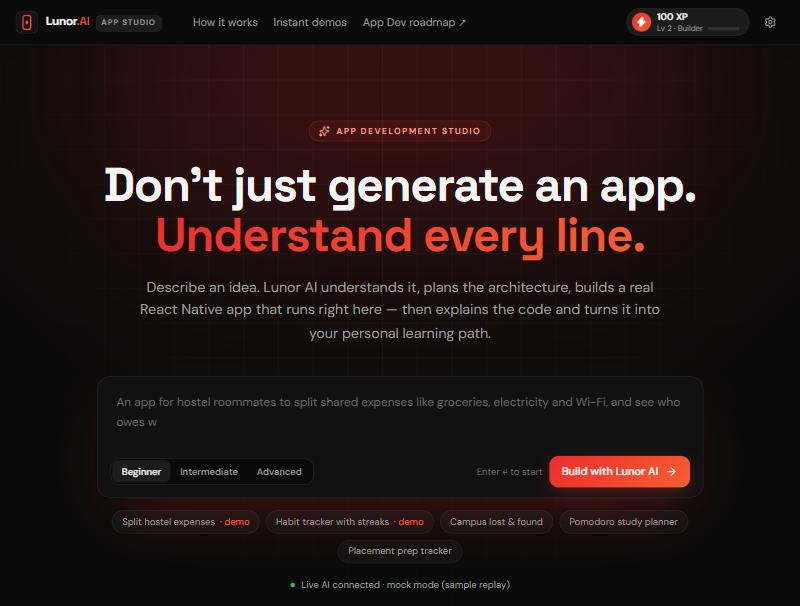
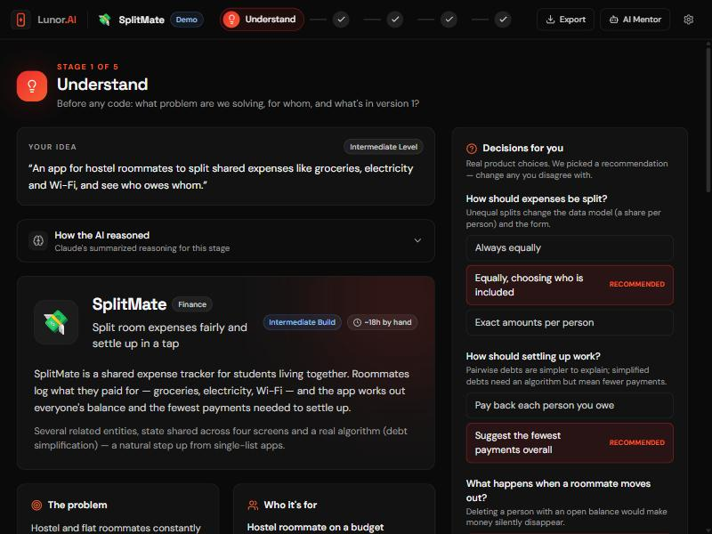
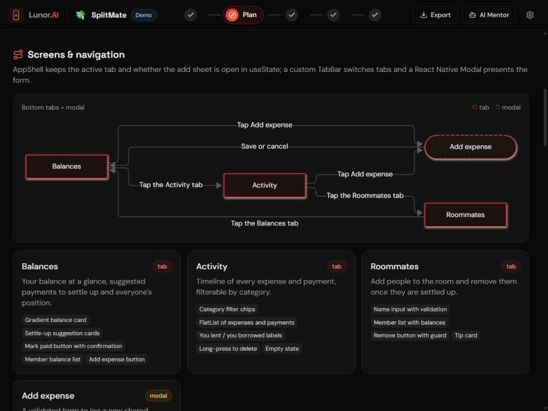
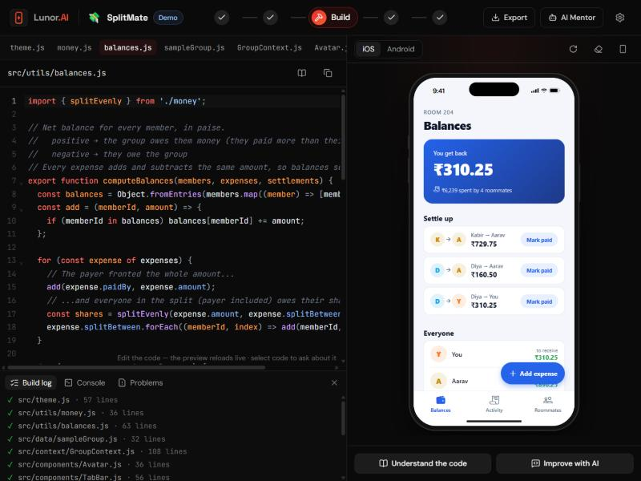
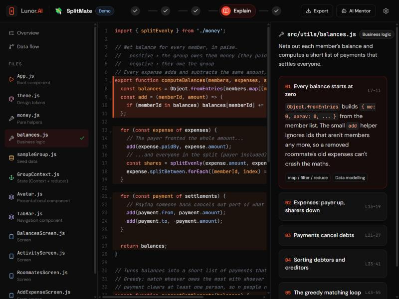
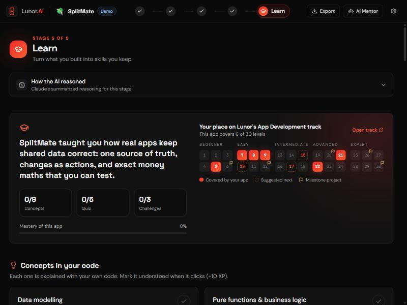
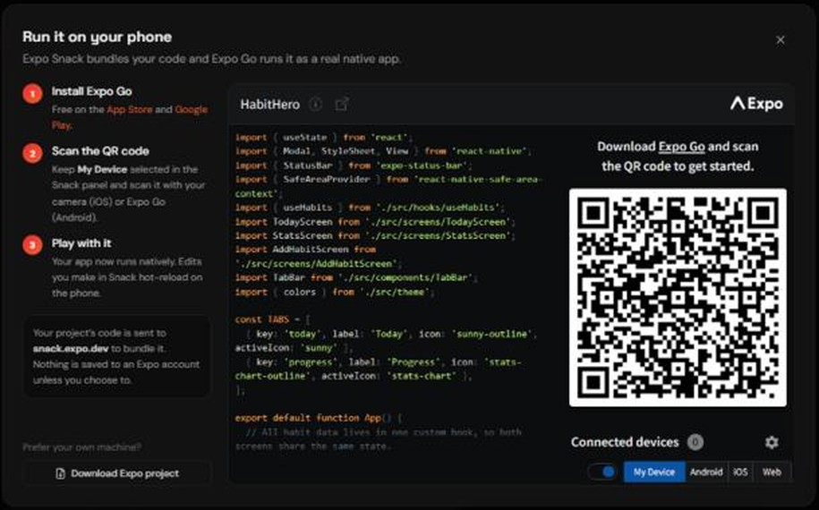
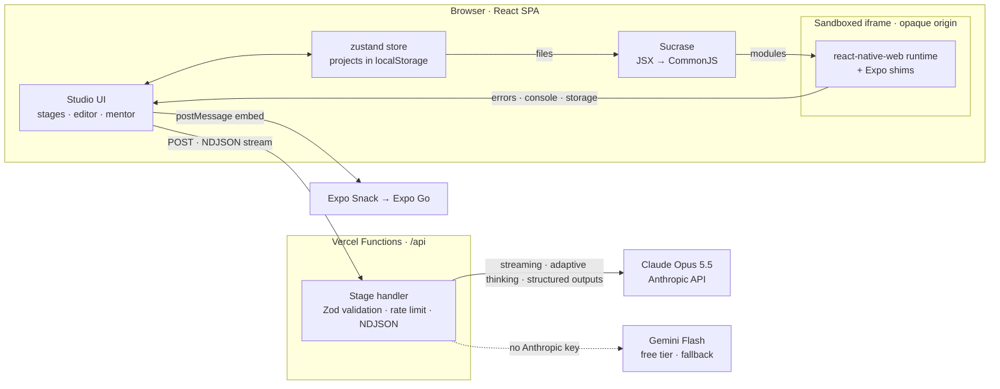

# Lunor App Studio

**Don't just generate an app. Understand every line.**

Lunor App Studio is a working prototype of an AI-powered **App Development** tool, built for the Lunor.AI internship challenge (Round 1). You describe an app idea. Then AI helps you:

- **understand** the idea,
- **plan** the architecture,
- **build** a real React Native + Expo app that runs instantly on a phone in your browser,
- **explain** every file, line by line,
- **turn it into a personal learning path** mapped to Lunor's 30-level App Development track.

> **Prompt → Understand → Plan → Build → Explain → Learn**, plus an AI mentor that can answer questions, edit code, fix crashes and review your own changes.
>
> The AI is **Claude** (Anthropic). A deployment without an Anthropic key can run on **Google Gemini's free tier** instead.



**Live demo:** [lunor-app-studio.vercel.app](https://lunor-app-studio.vercel.app)

---

## Try it in 30 seconds

No API key is needed. Open the app and pick an **instant demo**. Each one replays complete, pre-generated stage outputs through the same streaming UI that live AI uses.

| Demo | Level | What it shows |
| --- | --- | --- |
| 🔥 **HabitHero** | Beginner | A custom hook, AsyncStorage, FlatList, forms, streak maths |
| 💸 **SplitMate** | Intermediate | Context + useReducer, integer money maths, a settle-up algorithm |

For **live AI** on your own idea, the deployment needs a key: a free `GEMINI_API_KEY` from Google AI Studio or a paid `ANTHROPIC_API_KEY`. Visitors can also paste their own Anthropic key in **Settings**. A key pasted in Settings stays in the visitor's browser and is sent only with their requests.

---

## The five stages

| Stage | What the AI produces | Output | What you do |
| --- | --- | --- | --- |
| **① Understand** | Restated idea, target users, MoSCoW feature list, assumptions, out-of-scope, a scope note, complexity estimate, platform choice with alternatives, and the product decisions that change the design | JSON (structured output) | Untick features, answer the decisions |
| **② Plan** | Tech stack with reasons, screens and navigation, data model, state and persistence strategy, architecture layers, file plan, ordered build steps, risks | JSON (structured output) | Read the generated screen-flow and data-model diagrams |
| **③ Build** | A complete Expo SDK 57 app, streamed file by file | `<file path="…">` blocks | Watch it run in the phone preview, edit code live, run it on your real phone |
| **④ Explain** | Overview, a step-by-step data-flow trace, a line-anchored walkthrough of every file, glossary | JSON (structured output) | Click sections to highlight the exact lines |
| **⑤ Learn** | Concepts mapped to Lunor levels, a quiz about *your* code, three challenges, what to learn next | JSON (structured output) | Earn XP, take the quiz, extend the app with hints and AI reviews |
| **AI Mentor** | Answers, edits, crash fixes, code reviews | Markdown + `<file>` blocks | See every change as a diff, undo with one click |

| Understand | Plan |
| --- | --- |
|  |  |
| **Build** | **Explain** |
|  |  |
| **Learn** | **Run on your phone** |
|  |  |

### What makes it more than "prompt → app"

- **Reasoning is visible.** Every stage streams the model's summarized thinking ("How the AI reasoned"), so learners see *why* each decision was made.
- **The app really runs.** Generated code is compiled in the browser and runs on `react-native-web` inside a sandboxed phone frame. The frame has real Ionicons, Alerts, action sheets, AsyncStorage persistence and iOS/Android styling. Crashes show the failing line, and one click sends it to **Fix with AI**.
- **Explanations point at real lines.** Every code reference carries an anchor (the exact text of its first line), so highlights land on the right code even after edits.
- **Learning is grounded in Lunor's curriculum.** Concepts come from a fixed taxonomy (about 50 concepts, each mapped to a level of Lunor's 30-level App Development roadmap, with official docs links). So the learning path can't contain made-up links.
- **Take it with you.** Download a ready-to-run Expo project with a README and personal `LEARNING_NOTES.md`. Or open it in **Expo Snack** and scan the QR code with Expo Go to run it natively on your phone.
- **Robust builds.** If a build is interrupted, or imports a file it never wrote, the Studio resumes and asks the AI only for the missing files.

---

## Architecture



**Request path.** Each stage is a Vercel Function (`api/<stage>.ts`) built from one `StageDefinition`. The function:

1. validates the body with Zod;
2. picks a provider and key (`server/providers.ts`), in this order:
   - a visitor's own Anthropic key;
   - the server's `ANTHROPIC_API_KEY`;
   - the server's `GEMINI_API_KEY`;
3. applies a per-IP budget to server keys;
4. streams the model's output back as NDJSON: `meta`, `thinking`, `text`, `restart`, `ping` and `done`/`error` events. Both providers produce the same events, so the client can't tell them apart.

**Claude call** (`server/claude.ts`). It uses `client.beta.messages.stream` with:

- `thinking: { type: "adaptive", display: "summarized" }`;
- a per-stage `effort`;
- a JSON-schema `output_config.format` generated from the same Zod schemas the client validates with;
- a cached system prompt;
- `fallbacks: "default"`, so a safety-classifier refusal is retried server-side on a fallback model.

**Gemini call** (`server/gemini.ts`). It maps the same stage call onto `models.generateContentStream` from the official `@google/genai` SDK:

- the system prompt becomes `systemInstruction`;
- effort becomes `thinkingConfig.thinkingLevel`, with thought summaries streamed to the learner;
- JSON stages get a `responseJsonSchema` generated from the same Zod schemas;
- free models are sometimes overloaded or out of quota. A failed request is retried once, then fails over to the next free model (by default `gemini-3.8-flash` → `gemini-3.7-flash` → `gemini-3.6-flash` → `gemini-3.5-flash` → `gemini-3-flash-preview`; each has its own daily free quota). If a model stops mid-answer or goes silent, a `restart` event tells the client to discard the partial output, and the next model starts over.

**Client.** A zustand store runs the pipeline:

- JSON stages render progressively while they stream, using a partial-JSON parser.
- The build parses `<file>` blocks as they arrive, so the editor fills in live.
- Projects, progress and XP are saved to `localStorage`, with no account needed.

**Preview runtime** (`preview-runtime/`, bundled to `public/preview/runtime.js`):

- React, `react-native-web` and shims for Expo packages run in an iframe loaded via `srcdoc`, with `sandbox="allow-scripts allow-popups allow-forms"`.
- The host compiles each file with Sucrase, preserving line numbers, and posts the modules in.
- A tiny CommonJS loader runs them with `sourceURL`s, so stack traces map back to editor lines.
- AsyncStorage is bridged to the host, so app data survives reloads.

**Runtime contract** (`shared/runtimeContract.ts`). Generated apps may import only React, React Native core and a curated set of Expo packages. That set works in the browser preview *and* in Expo Go. The model is told this contract, and the compiler enforces it.

---

## AI tools and technologies used

**AI inside the product**

- **Claude Opus 5.5** (`claude-opus-5-5`, by Anthropic) powers all five stages and the mentor. It's called with the official **Anthropic TypeScript SDK** (`@anthropic-ai/sdk`). Features used:
  - streaming;
  - adaptive thinking with summarized thinking shown to the learner;
  - structured outputs (JSON Schema generated from Zod via `betaZodOutputFormat`);
  - prompt caching;
  - per-stage `effort`;
  - server-side refusal fallbacks (`fallbacks: "default"`, beta `server-side-fallback-2026-07-01`).
- **Google Gemini** (`gemini-3.8-flash`, with `gemini-3.7-flash`, `gemini-3.6-flash`, `gemini-3.5-flash` and `gemini-3-flash-preview` as fallbacks) is an optional free-tier fallback. It's used only when no Anthropic key is configured, and called with the official **Google Gen AI SDK** (`@google/genai`). Features used: streaming, thought summaries, JSON-schema structured output.
- The two instant demos (HabitHero, SplitMate) were **pre-generated with Claude**. Tests verify them: every document is schema-validated, and every line reference is checked against the code.

**AI used to build it**

- **Claude Code**, Anthropic's agentic coding tool (running Claude Opus 5.5), was the AI pair programmer. It helped with architecture, implementation, tests, debugging and the demo content.

**Other technology**

- **Front end:** React 19, TypeScript, Vite 8, Tailwind CSS 4, zustand, CodeMirror 6, Mermaid, react-markdown, Motion, Radix Dialog, lucide-react
- **Preview:** react-native-web 0.21, Sucrase, @expo/vector-icons fonts (jsDelivr), Expo Snack (run on a real phone)
- **Server:** Vercel Functions (Node), Zod 4
- **Export:** JSZip
- **Testing:** Vitest

---

## Run locally

Requirements: Node.js 20+.

```bash
npm install
cp .env.example .env.local   # add GEMINI_API_KEY (free) or ANTHROPIC_API_KEY
npm run dev                  # http://localhost:5173
```

No key? Mock mode streams the bundled samples through the **real** API route and NDJSON streaming path. It's useful for developing the pipeline for free:

```bash
npm run dev:mock
```

Other scripts:

| Command | What it does |
| --- | --- |
| `npm test` | Runs the Vitest suite |
| `npm run test:live` | Takes a fresh idea through all five stages on the real provider in `.env.local`, and validates every output (uses real quota) |
| `npm run typecheck` | Runs `tsc --noEmit` over app, server, runtime and tests |
| `npm run build` | Builds the preview runtime, then the production bundle into `dist/` |
| `npm run check` | Runs typecheck, tests and build (use before deploying) |

## Deploy to Vercel

1. Push this folder to a GitHub repository and **Import** it at [vercel.com/new](https://vercel.com/new). You can also run `npx vercel` from the project folder. `vercel.json` already sets the build command, output directory, SPA rewrites and a 300-second function limit.
2. In **Project → Settings → Environment Variables**, add `GEMINI_API_KEY` (free) or `ANTHROPIC_API_KEY`. If both are set, Claude is used. Optional variables:
   - `ANTHROPIC_MODEL`
   - `GEMINI_MODEL`, `GEMINI_FALLBACK_MODELS`
   - `LUNOR_RATE_LIMIT`
   - `LUNOR_EFFORT_<STAGE>`

   See [`.env.example`](.env.example) for all of them.
3. Deploy. Without any server key, the deployment still works: instant demos run, and visitors can paste their own Anthropic key in Settings.

### Cost and limits

**On Gemini's free tier** there's no charge. Google limits requests per model for your whole Google project, and you can see the limits in AI Studio. When one model's quota runs out, the app fails over to the next free model. Busy periods can still show a "try again in a minute" message.

**On Claude**, prices are for Claude Opus 5.5, at $4 per million input tokens and $20 per million output tokens:

- **A full pipeline (five stages) for a typical 10–12-file app** uses roughly 50K input and 40K output tokens: **about $1 per app**. The build and explain stages cost the most.
- **A mentor message** costs a few cents.
- **Cheaper runs:** set `ANTHROPIC_MODEL=claude-sonnet-5-5` ($2 / $10) to roughly halve the cost.
- **Caching:** system prompts and project context are cached, and cache reads cost $0.20 per million tokens.
- **Rate limit:** requests on a server key (Claude or Gemini) are limited per IP. The budget is `LUNOR_RATE_LIMIT` points per 15 minutes (default 45); a build counts as 3 points and other stages as 1. Requests using a visitor's own key aren't limited.
- **Spend cap:** for a public deployment, also set a spend limit on your key in the Claude Console.

---

## Security and privacy

- **Sandboxed preview.** Generated code runs in a sandboxed iframe with an opaque origin. It can't read the Studio's storage, cookies or DOM, and it talks to the host only through a narrow `postMessage` protocol.
- **Keys.** The server key never reaches the browser. A key a user pastes in Settings is kept in *their* `localStorage` and sent per request in a header. It's never stored or logged on the server.
- **Local data.** Projects, XP and settings live only in the visitor's browser. **Settings → Delete all data** wipes all of it in one step.
- **Input checks.** Every request is validated with Zod and size-capped, and per-IP rate limits protect the server keys.
- **Gemini free tier.** Google's terms say free-tier content may be used to improve Google's products. On a deployment that runs on Gemini's free tier, visitors' ideas and code are sent to Google on those terms.
- **Diagrams.** They're generated deterministically from the plan JSON, with every label escaped. The model never writes diagram syntax, and Mermaid runs with `securityLevel: "strict"`.
- **Snack.** "Run on your phone" says clearly that the project's code is sent to snack.expo.dev.

## Tests

`npm test` runs 91 tests covering:

- the streaming `<file>` protocol parser;
- anchor-based line resolution;
- the runtime contract (imports, packages, missing files);
- the in-browser compiler;
- Mermaid generation and escaping;
- the HTTP handler: validation errors, no-key response, schema-valid mock streaming, and resuming an interrupted build;
- the API's local imports, which must use `.js` extensions or every Vercel function crashes at startup;
- provider choice and the Gemini adapter: request mapping, error codes, model failover (including answers cut off mid-stream and stalled connections) and the client's `restart` handling;
- the Expo ZIP export and the Snack payload;
- **sample integrity**: every demo document passes its schema, every file is planned and explained, every concept exists in the Lunor taxonomy, and every line reference lands on its anchor;
- SplitMate's money logic, including a randomized check that balances always sum to zero and the suggested payments always settle everyone.

`npm run test:live` goes further: it takes a fresh idea through all five stages on the real provider configured in `.env.local`. It validates every output against its schema, compiles the generated app, and checks that the walkthrough's line references resolve.

## Project structure

```
api/              Vercel Functions: one file per stage + /api/config
server/           Claude + Gemini clients, provider choice, prompts, stage definitions, handler, rate limit, mock mode
shared/           Zod schemas, Lunor roadmap + concept taxonomy, runtime contract,
                  <file> protocol, code-reference resolver, preview protocol
src/
  pages/          Landing, Studio
  stages/         Understand, Plan, Build, Explain, Learn
  components/     Mentor panel, code view, markdown, diagrams, dialogs, UI kit
  preview/        Compiler, phone frame, sandboxed preview frame
  store/          Pipeline state machine (zustand)
  lib/            AI streaming client, projects, XP, exporters, diagrams, replay
preview-runtime/  react-native-web runtime + Expo shims (bundled into public/preview)
samples/          Instant demos: stage outputs + complete app source
tests/            Vitest suite (tests/live: opt-in end-to-end run on a real provider)
```

## Limitations and next steps

- Projects live in the browser's `localStorage`: there are no accounts and no sync between devices.
- The preview runs on `react-native-web`, so apps are limited to the runtime contract. Native-only features (camera, notifications, maps) are listed as "next steps" rather than generated.
- Rate limiting is in-memory per function instance. A shared store such as Redis would be needed at scale.
- **Natural next steps:**
  - Lunor sign-in with synced projects;
  - challenges linked to Lunor course levels;
  - expo-router support;
  - EAS Build for installable APKs;
  - sketch-to-UI;
  - a mentor view for instructors.
